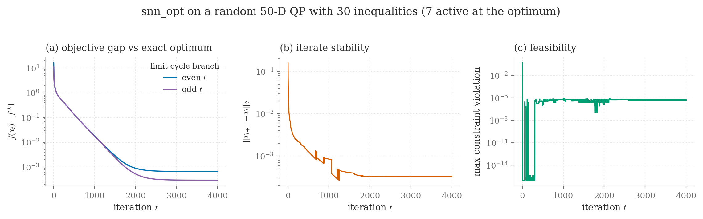
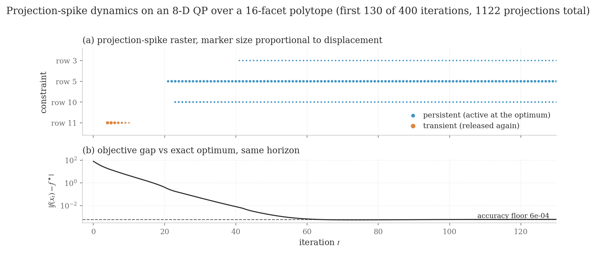
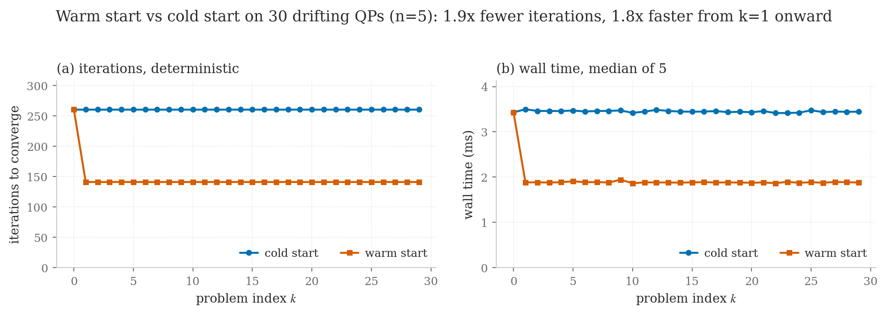
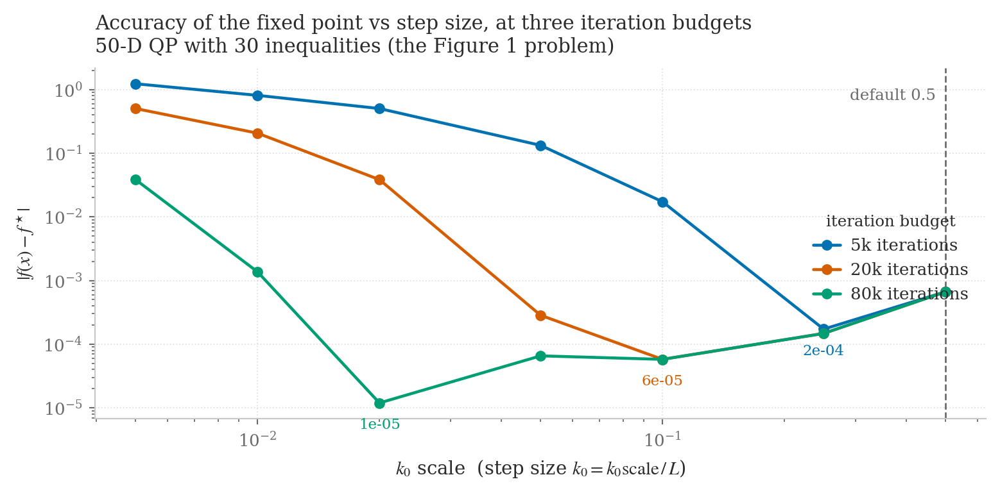
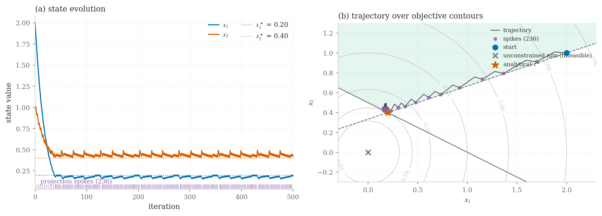
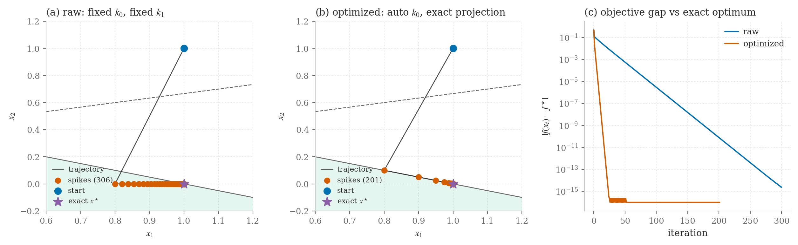

# snn_opt

**A spiking neural network solver for constrained convex optimization.**

[](LICENSE)
[](https://www.python.org/downloads/)
[](CHANGELOG.md)
[](CITATION.cff)
[](https://snn.ahkhan.me)

---

## Abstract

`snn_opt` is a Python implementation of the **spiking neural network (SNN) → convex optimization** equivalence, developed as part of an ongoing research program on neuromorphic computation for classical machine-learning problems. It solves quadratic and linear programs of the form

$$
\min_{x \in \mathbb{R}^n}\ \tfrac{1}{2}\, x^\top A x + b^\top x
\quad\text{subject to}\quad C x + d \le 0,
$$

by alternating gradient descent, which plays the role of leaky-integrate membrane drift, with discrete projection events that clamp the trajectory to the constraint boundary, the optimization analogue of an integrate-and-fire **spike**. The construction follows Mancoo, Boerlin and Machens ([NeurIPS 2020](https://papers.nips.cc/paper/2020/hash/64714a86909d401f8feb83e8c2d94b23-Abstract.html)) and is the canonical solver underlying the **SNN-X** research program, a series of classical machine-learning problems recast as constrained convex programs and solved by these dynamics (see [Applications](#applications)).

This repository is intended both as a **research artifact**, since every published SNN-X paper can be reproduced from the code here, and as a **teaching resource** for students entering the area: it ships with annotated examples, a self-contained mathematical writeup, and a benchmark suite that visualizes convergence, projection dynamics, and the solver's accuracy limits.

## The problem

Given a positive semi-definite Hessian $A \in \mathbb{R}^{n\times n}$, a linear cost $b \in \mathbb{R}^n$, and $m$ linear inequality constraints stacked into $C \in \mathbb{R}^{m \times n}$ and $d \in \mathbb{R}^m$, we seek

$$
x^\star \;=\; \arg\min_{x}\ \tfrac{1}{2}\, x^\top A x + b^\top x \quad\text{s.t.}\quad c_i^\top x + d_i \le 0,\ i = 1,\dots,m.
$$

The class subsumes box-constrained QPs (set $C = [I; -I]$), linear programs ($A = 0$), kernel-ridge subproblems, support-vector machine duals, projected-gradient flows on polytopes, and the bulk of the inner solves that arise in receding-horizon control.

## The spiking idea, in one picture

The continuous-time dynamics

$$
\dot x \;=\; -\nabla f(x) \;-\; C^\top s(t)
$$

models a population of $n$ leaky integrators driven by the gradient $\nabla f(x) = Ax + b$, with a corrective spike train $s(t)$ that fires whenever an inequality $c_i^\top x + d_i$ would otherwise become positive. Each spike applies a *minimal* projection that re-enters the feasible set; spike inter-arrival times encode constraint *traffic*. Discretized with forward Euler and an adaptive step that reaches the boundary exactly, this becomes a fast projected-gradient solver with diagnostics that double as a neural raster plot.

See [`docs/theory.md`](docs/theory.md) for the full derivation, including the eigenvalue-based step-size choice that eliminates `k0` as a hyperparameter and the treatment of bound constraints as implicit facets of the same projection sweep.

## Convergence and projection dynamics

Four diagnostic figures, regenerated from [`benchmarks/`](benchmarks/) with
`python benchmarks/run_all.py`, give a quick visual sense of what the solver
actually does. Every objective gap below is measured against an **exact**
optimum computed by the active-set KKT solve in
[`benchmarks/qpref.py`](benchmarks/qpref.py), never against a long run of
`snn_opt` itself; scoring the solver against its own fixed point cannot reveal a
standing offset between that fixed point and the true minimiser, and on these
problems there is one.

**Convergence on a random 50-D QP with 30 inequalities** (7 active at the
optimum). The gap descends geometrically for about 1800 iterations, then the
iterate settles into a **period-2 limit cycle**: it alternates between two
points whose gaps are 3.0e-4 and 6.7e-4, which is why the two branches in panel
(a) are drawn separately and why panel (b) flatlines rather than decaying. The
run is jointly feasible throughout (max row distance 8.2e-7) and reports
`converged=False` at the 4000-iteration cap. See
[Accuracy and tuning](#accuracy-and-tuning) for where that floor comes from.



**Projection-spike raster** on an 8-D QP over a 16-facet polytope whose
unconstrained minimiser sits well outside the feasible set. Each marker is one
projection event. The network visibly *searches* for the active set: row 11
fires a burst around t = 4..10 and then falls silent, while rows 5, 10 and 3 are
recruited at t ~= 21, 23 and 41 and fire on every step thereafter. Those three
persistent rows are exactly the active set of the true optimum. This is the
practical payoff of the spiking view, and the literal sense in which the solver
is *spiking*.



**Warm-start speedup** on a sequence of 30 drifting QPs, a stylized MPC
workload. From the second problem onward, warm starting cuts a 261-iteration
cold solve to 141 iterations, an essentially free 1.85x, and wall time falls in
step (1.84x). Iterations are the headline because they are deterministic; the
wall-time panel is the median of five timed runs per problem, since a single
pass picks up scheduler noise indistinguishable from signal.



**Accuracy against step size**, at three iteration budgets. The spiking dynamics
converge to a fixed point of the *discretised* flow, which is offset from the
exact minimiser by an amount that shrinks with the gradient step `k0`. Smaller
`k0` also means more iterations are needed to arrive, so each budget has a knee,
and the knee moves left as the budget grows. The shipped default
(`k0_scale = 0.5`) sits to the right of every knee: on this problem it leaves a
gap of 6.7e-4, while `k0_scale = 0.02` reaches 1.2e-5 given 80k iterations.



### A closer look: trajectory and raw-vs-optimized modes

Two figures generated by the example scripts give a more concrete sense of what
the dynamics look like in 2-D, where everything is easy to visualize:



*State evolution and 2-D trajectory for `examples/example1_basic_2d.py`, a
constrained QP whose unconstrained minimum lies outside the feasible polytope.
Left: per-component value over time, with the projection events shown as a rug
along the bottom. The sawtooth in each trace is the integrate-and-fire dynamic
itself: drift away from the boundary, spike back onto it, repeat. Right: the
trajectory in state space over objective contours, gliding down the gradient,
meeting the active facet and sliding along it to the constrained optimum. This
example deliberately runs `projection_method='fixed'`, which produces many small
corrections rather than one exact jump, because that is what makes the spiking
behaviour visible.*



*Output of `examples/example_raw_mode.py`, comparing a fixed gradient and
projection step against the defaults (auto `k0` from the Lipschitz constant,
exact projection to the boundary). Both reach the optimum on a problem whose
constraint is active at the solution: the optimized run gets within 1e-16 of the
exact objective in roughly 25 iterations, while the raw run needs the full 300
to reach 1e-15.*

## Installation

`snn_opt` requires Python 3.9+, NumPy, and SciPy. The fastest path is PyPI:

```bash
pip install snn-opt                # core, prebuilt wheel (no compiler needed)
pip install "snn-opt[examples]"    # also installs matplotlib for examples
pip install "snn-opt[dev]"         # examples + cvxpy + pytest + ruff
```

> The PyPI distribution name is `snn-opt` (hyphenated, lowercase, per PEP 503); the Python import name is `snn_opt`. So you `pip install snn-opt` and then `import snn_opt`.

For an editable install from a checkout (development workflow):

```bash
git clone https://github.com/ahkhan03/SNN_opt.git
cd SNN_opt
pip install -e .                   # core
pip install -e ".[examples]"       # also installs matplotlib for examples
pip install -e ".[dev]"            # examples + cvxpy + pytest + ruff
```

For a specific commit (reproducibility for papers/collaborators):

```bash
pip install "git+https://github.com/ahkhan03/SNN_opt.git@<commit-sha>"
```

The package can also be run **without** installation: every example and test sits next to a small `sys.path` bootstrap that points at `src/`. Smoke test:

```bash
python tests/test_installation.py
```

### Compiled C++ backend

The PyPI wheels ship a precompiled C++ kernel (`snn_opt._kernel`) that accelerates the inner adaptive-projection loop by roughly an order of magnitude over the pure-Python path. Opt in via the `backend` keyword:

```python
result = solve_qp(A, b, C, d, x0, backend='c')        # compiled kernel (auto)
result = solve_qp(A, b, C, d, x0, backend='python')   # reference (default)
```

The compiled kernel comes in three numerically identical variants that differ
only in how the inner matrix–vector products are threaded:

| `backend`    | matvec threading                                                              |
|--------------|------------------------------------------------------------------------------|
| `'c'`        | auto: OpenMP multicore when the wheel was built with it, else single-thread |
| `'c_serial'` | forced single-thread (SIMD only)                                             |
| `'c_openmp'` | forced OpenMP multicore (raises if the wheel was built without OpenMP)       |

Only the matvec is data-parallel; the Euler recurrence and the greedy projection
are inherently serial (an Amdahl ceiling of roughly 2–3× on a few cores). Because
per-call thread fork/join only pays off on large systems, the multicore path is
automatically skipped below a work threshold, so `'c'` matches the serial path on
small/medium problems and only spins up threads on large ones. Multithreading
honours `OMP_NUM_THREADS`; `snn_opt._kernel.HAS_OPENMP` and
`snn_opt._kernel.max_threads()` report the build's capability.

All backends are kept in lockstep by the parity test suite (`tests/test_c_backend_parity.py`). The C kernel supports dense problems with `projection_method='adaptive'`; sparse and non-adaptive paths transparently use Python. The same kernel source is HLS-compatible and is the basis for the FPGA deployment track. When the precompiled kernel is unavailable on your platform (rare), the `'c*'` backends raise a clear error and the Python backend continues to work.

### Problem transforms (eigenbasis)

Orthogonal to the backend, the **transform axis** rewrites the problem into an equivalent one that is cheaper to solve and maps the solution back. Transforms are an explicit opt-in (`SolverConfig.transform`); the canonical solver stays the default, and a transform composes with any backend.

```python
from snn_opt import solve_qp
result = solve_qp(A, b, C, d, x0, ...)  # canonical (default)

from snn_opt import SNNSolver, SolverConfig, OptimizationProblem
cfg = SolverConfig(transform='eigenbasis', backend='c')
result = SNNSolver(OptimizationProblem(A, b, C, d), cfg).solve(x0)
```

`EigenbasisTransform` (`transform='eigenbasis'`) rotates a symmetric-PSD Hessian into its eigenbasis (`A = VΛVᵀ`), collapsing the dominant `O(n²)` `A @ x` gradient step into an `O(n)` elementwise product; the projection is unchanged because the constraint Gram is rotation-invariant. The win grows with problem size.

Since v0.5.0 the transform **does accept box bounds**. Per-coordinate bounds are not rotation-invariant, so they cannot stay implicit: they are materialized as explicit rotated unit-norm rows, growing `m` by up to `2n`. The `O(1)` implicit-facet advantage is deliberately surrendered under a transform, which is the trade to be aware of when combining the two. See [`docs/api.md`](docs/api.md#transforms).

## What v0.5.0 changed

v0.5.0 is a **structural correctness release**, and the behaviour it fixes is
worth understanding before relying on results from an earlier version.

Before v0.5.0, bound constraints were enforced by a terminal clip applied after
the halfspace sweep, with nothing re-projecting behind it. Composing the two is
not a projection onto their intersection (the classical POCS failure), so on a
problem where a bound and an interacting row are simultaneously active, the
solver could stall at a point feasible for neither and report an objective that
*undercuts* the true optimum. Bounds are now implicit unit-normal facets inside
one unified projection sweep, and the terminal clip is gone.

Three result fields exist to make that state visible, and they are the ones to
check on any nontrivial problem:

```python
result.joint_feasible            # feasibility of rows AND bounds together
result.stationarity_residual     # NNLS KKT certificate at the final point
result.projection_budget_exhausted
```

* **`joint_feasible`** is the honest feasibility flag. Pre-0.5 the convergence
  gate looked at rows only, so a box violation could not fail it.
* **`stationarity_residual`** solves `min_{mu >= 0} ||grad f + sum mu_i a_i||`
  over the active unified normals. `converged` tells you the network reached a
  fixed point; this tells you how far that fixed point is from a KKT point. On
  the Figure 1 benchmark it reads 2.35, which is the quantitative statement of
  the limit cycle visible in that figure.
* **`projection_budget_exhausted`** reports that the sweep hit its watchdog.
  `max_projection_iters` is now a safety cap (default `None`, auto-sized), and
  hitting it **aborts** the solve rather than being reported as convergence.

`projection_method='fixed'` combined with bounds now raises, because the legacy
fixed-step path cannot enforce bounds correctly without the clip that was
removed.

## Accuracy and tuning

The spiking dynamics converge to a fixed point of the discretised flow, not to
the exact minimiser of the QP. On well-conditioned problems the two are close;
they are not identical, and the difference is set by the gradient step size
`k0 = k0_scale / L`.

Concretely, on the 50-D benchmark of Figure 1 with the shipped defaults, the
solver reaches a **period-2 limit cycle** whose objective gap against the exact
optimum alternates between 3.0e-4 and 6.7e-4, and stays there: the value is
identical to ten significant figures at 20k and at 100k iterations. It is
jointly feasible the whole time. So the limitation is accuracy of the fixed
point, not feasibility.

What to do about it, in order of usefulness:

1. **Read `stationarity_residual`.** A converged-looking run with a large
   residual is sitting at a fixed point of the network that is not a KKT point
   of the QP. It is the cheapest signal that the answer is not as good as
   `converged=True` suggests.
2. **Lower `k0_scale`, and raise the iteration budget with it.** Figure 4 maps
   the trade. On that problem, 0.5 gives 6.7e-4 and 0.02 gives 1.2e-5, but only
   if the budget is large enough to arrive; at 5k iterations the same 0.02
   setting is far *worse* than the default. Tune the pair, never `k0_scale`
   alone.
3. **Polish externally if you need machine precision.** Once the active set is
   correct (and it usually is, see Figure 2), the exact optimum follows from one
   equality-constrained KKT solve on those rows. That is exactly what
   `benchmarks/qpref.py` does, in well under a millisecond on these sizes.

Two known limitations are worth stating plainly. **Ill-conditioned or stiff
QPs** are the harder case: the native adaptive stepping can fail to reach
tolerance and return an infeasible point, and naive Jacobi/diagonal
preconditioning conflicts with the adaptive step-size rule rather than fixing
it. And note that **`converged=False` is not by itself diagnostic** of either
issue: check `joint_feasible`, `stationarity_residual` and
`projection_budget_exhausted` to tell them apart.

## Quick start

```python
import numpy as np
from snn_opt import solve_qp

# Minimize ||x||^2 subject to  x_1 + 2 x_2 <= 1  (and that's it).
A  = np.eye(2)
b  = np.zeros(2)
C  = np.array([[1.0, 2.0]])
d  = np.array([-1.0])
x0 = np.array([1.0, 1.0])

result = solve_qp(A, b, C, d, x0, max_iterations=1000)

print(result.summary())             # converged?  iterations?  spikes?
print("x* =", result.final_x)
print("f* =", result.final_objective)
```

For repeated solves (warm-started receding-horizon problems), construct an `SNNSolver` once and call `.solve(x0)` per problem instance; see [`examples/example4_warm_start.py`](examples/example4_warm_start.py).

## Examples

All scripts live under [`examples/`](examples/) and are runnable as plain `python examples/example_name.py`.

| # | Script | Problem | Highlights |
|---|---|---|---|
| 1 | [`example1_simple_2d.py`](examples/example1_simple_2d.py) | 2D quadratic with two linear cuts | Smallest possible runnable demo |
| 1b | [`example1_basic_2d.py`](examples/example1_basic_2d.py) | Same problem, with trajectory plot | See `examples/example1_basic_2d.png` |
| 1c | [`example1_advanced_2d.py`](examples/example1_advanced_2d.py) | Shifted feasible region, infeasible start | Spike raster + violation plot |
| 2 | [`example2_3d_polytope.py`](examples/example2_3d_polytope.py) | 3D QP with 4 hyperplanes | Multiple active constraints, vertex solution |
| 3 | [`example3_linear_program.py`](examples/example3_linear_program.py) | Box-constrained LP ($A=0$) | LP via the same machinery |
| 4 | [`example4_warm_start.py`](examples/example4_warm_start.py) | Sequence of related QPs | Receding-horizon / MPC pattern; spikes drop $30 \to 0$ |
| 5 | [`example5_infeasible_recovery.py`](examples/example5_infeasible_recovery.py) | Infeasible initializations | Automatic projection to feasibility |
| 6 | [`example6_equality_constraint.py`](examples/example6_equality_constraint.py) | Equality via a sandwiched band | $x_1 = a$ as a tight $\pm \varepsilon$ inequality pair |
| 7 | [`example7_svm_dual.py`](examples/example7_svm_dual.py) | SVM dual with kernel | Box clipping + auto step size on a real ML task |
| . | [`example_raw_mode.py`](examples/example_raw_mode.py) | Bypass auto-config | Compares raw vs. optimized solver settings |

Run them all in sequence:

```bash
python examples/run_all_examples.py
```

## Documentation

- [`docs/theory.md`](docs/theory.md): derivation of the SNN/convex-optimization equivalence, step-size analysis, projection geometry, convergence criteria.
- [`docs/applications.md`](docs/applications.md): catalogue of the published work that uses this solver.
- [`docs/api.md`](docs/api.md): hand-curated API reference.
- [`benchmarks/README.md`](benchmarks/README.md): what each figure shows and how to regenerate it.
- [https://snn.ahkhan.me](https://snn.ahkhan.me): companion site, designed for a broader audience (students, curious researchers).

## Applications

The framework is currently demonstrated in:

- **Khan, Mohammed & Li (2025)**, *Portfolio Optimization: A Neurodynamic
  Approach Based on Spiking Neural Networks*, **Biomimetics**, 10(12):808.
  [doi:10.3390/biomimetics10120808](https://doi.org/10.3390/biomimetics10120808).
  Portfolio selection cast as a constrained QP and solved by the spiking
  dynamics implemented here.

Additional applications are in preparation. As they reach publication
they will be added to [`docs/applications.md`](docs/applications.md).

## Citing this work

If `snn_opt` plays a role in your research or teaching, please cite both the software and the framework paper:

```bibtex
@software{khan2026snnopt,
  author  = {Khan, Ameer Hamza and Li, Shuai},
  title   = {snn\_opt: A Spiking Neural Network Solver for Constrained Convex Optimization},
  year    = {2026},
  version = {0.5.0},
  url     = {https://github.com/ahkhan03/SNN_opt},
  license = {Apache-2.0},
}

@inproceedings{mancoo2020understanding,
  author    = {Mancoo, Allan and Boerlin, Martin and Machens, Christian K.},
  title     = {Understanding Spiking Networks Through Convex Optimization},
  booktitle = {Advances in Neural Information Processing Systems (NeurIPS)},
  year      = {2020},
}
```

The full per-paper bibliography of the SNN-X series is maintained at [`docs/applications.md`](docs/applications.md).

## License

Apache-2.0, see [`LICENSE`](LICENSE). Permissive, with an explicit patent grant; suitable for both academic and commercial reuse.

## Acknowledgments

Developed at the **School of Artificial Intelligence, Taizhou University**.

This codebase implements the SNN-QP research program led by **Prof. Shuai Li** (IEEE Fellow; Faculty of Information Technology and Electrical Engineering, University of Oulu, Finland), whose work on neurodynamic optimization originated this line of inquiry. The mathematical framework follows Mancoo, Boerlin and Machens (NeurIPS 2020) and the broader projection-neural-network lineage (Hopfield–Tank, Kennedy–Chua, Xia–Wang, Liu–Wang). Pull requests, bug reports, and citations of the SNN-X papers in your own work are all warmly welcomed.
