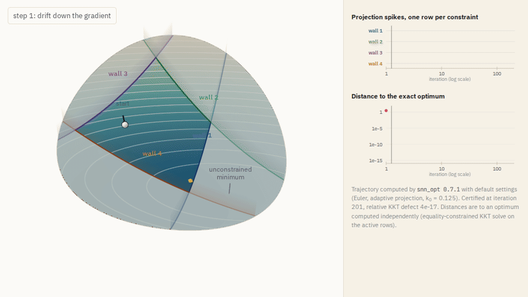
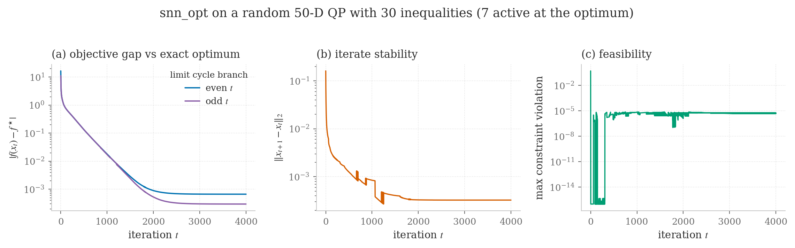
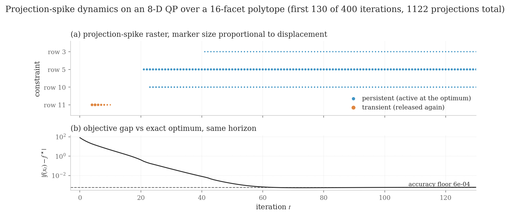
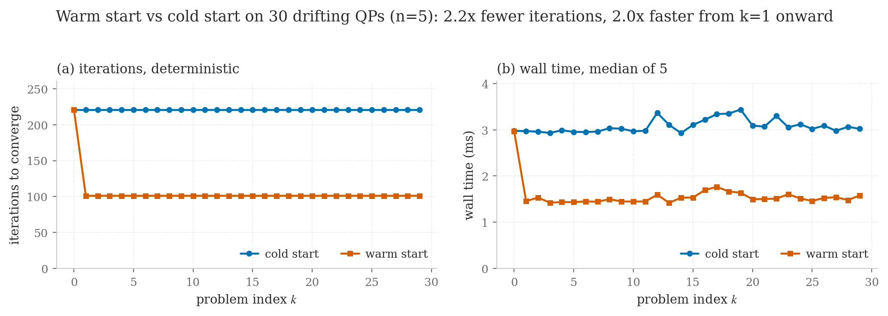
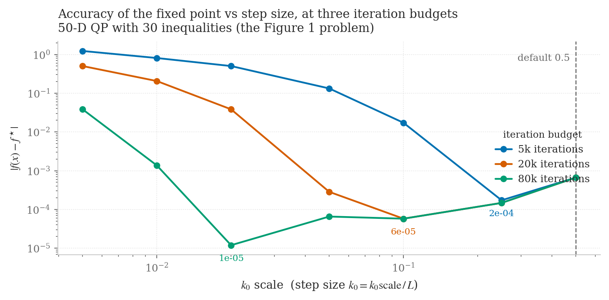
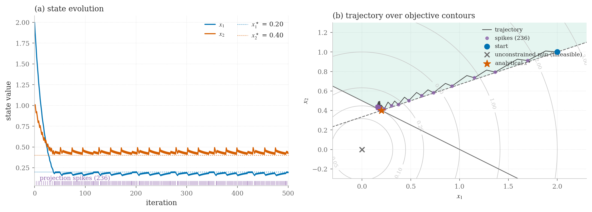
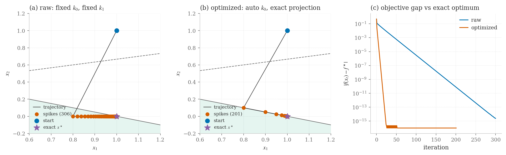
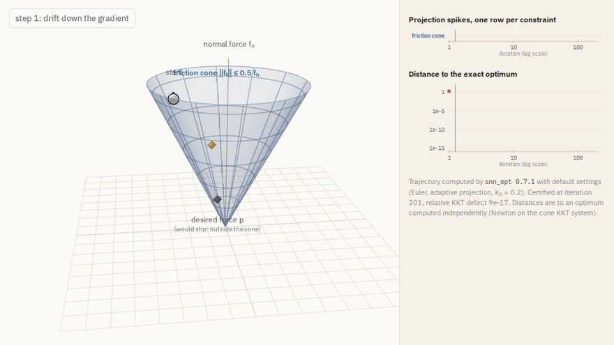

# snn_opt

**A spiking neural network solver for constrained convex optimization.**

[](https://pypi.org/project/snn-opt/)
[](LICENSE)
[](https://www.python.org/downloads/)
[](CHANGELOG.md)
[](CITATION.cff)
[](https://snn.ahkhan.me)



*A real run, not an illustration. The bowl is the objective of a 2-D
quadratic program; the coloured walls are its four linear constraints. Each
Euler step drifts down the gradient (the marker has no momentum: this is a
first-order flow drawn on the surface). When a step crosses a wall, the
state is reset onto it, and that reset is a **spike** (right, top). The
network *searches*: wall 4 fires for three steps and falls silent, then wall
1 is recruited and fires on every step until the optimum. The run certifies at iteration 201, 2e-16 from an optimum computed independently
(right, bottom). Default settings, `snn_opt` 0.7.1. Interactive 3-D version:
[snn.ahkhan.me](https://snn.ahkhan.me).*

## Abstract

`snn_opt` implements the **spiking neural network (SNN) → convex optimization**
equivalence as a practical solver. It minimises a convex quadratic

```math
\min_{x \in \mathbb{R}^n}\ \tfrac{1}{2}\, x^\top A x + b^\top x
\quad\text{subject to}\quad C x + d \le 0,\quad x \in K_1 \cap \dots \cap K_r,
```

by alternating gradient descent, the leaky-integrate *drift* of a membrane
potential, with discrete projection events that reset the state onto the
constraint it crossed, the optimization analogue of an integrate-and-fire
**spike**. The $K_q$ are optional convex sets added in v0.7.0: balls,
second-order and friction cones, the PSD cone, spectral-norm balls, affine
subspaces, intersections of these, and user-supplied differentiable convex
inequalities. The construction follows Mancoo, Keemink and Machens
([NeurIPS 2020](https://papers.nips.cc/paper/2020/hash/64714a86909d401f8feb83e8c2d94b23-Abstract.html));
the solver itself is described in Khan, Cao and Li,
[*Neurocomputing* 2026](https://doi.org/10.1016/j.neucom.2026.134705), and
underlies the **SNN-X** research program, classical machine-learning and
control problems recast as constrained convex programs and solved by these
dynamics (see [Applications](#applications)).

The repository is both a **research artifact**, since published SNN-X results
reproduce from the code here, and a **teaching resource**: annotated
examples, a self-contained mathematical writeup, and benchmarks that show
convergence, projection dynamics and the solver's accuracy limits against
exact references.

## The idea in three moves

1. **Drift.** Between spikes the state follows the negative gradient,
   $x \leftarrow x - k_0 \nabla f(x)$, with $\nabla f(x) = Ax + b$. This is
   a population of leaky integrators driven by the objective.
2. **Spike.** When a step leaves the feasible set, the most-violated
   constraint fires and applies a minimal correction back onto its boundary:
   a step along $c_j$ for a row, an exact projection for a cone or ball.
   Firings repeat within the step until every constraint holds.
3. **Settle.** At the optimum the drift into the active walls is exactly
   balanced by their spikes. Which constraints keep firing *is* the active
   set, and their firing balances the gradient as the KKT multipliers do,
   so the spike raster doubles as a readout of the solution's structure.

In continuous time this is $\dot x = -\nabla f(x) - C^\top s(t)$ with a
corrective spike train $s(t)$; discretised with forward Euler and an
adaptive projection that reaches the boundary exactly, it is a projected
gradient method whose diagnostics are a neural raster.
[`docs/theory.md`](docs/theory.md) derives it from LIF dynamics, including
the eigenvalue-based step size that removes `k0` as a hyperparameter.

## Quick start

```bash
pip install snn-opt            # prebuilt wheels: Linux, macOS, Windows; CPython 3.9-3.14
```

```python
import numpy as np
from snn_opt import solve_qp

# Minimise ||x||^2 subject to  x_1 + 2 x_2 >= 1, written as -x_1 - 2 x_2 + 1 <= 0.
A  = np.eye(2)
b  = np.zeros(2)
C  = np.array([[-1.0, -2.0]])
d  = np.array([1.0])
x0 = np.array([1.0, 1.0])

result = solve_qp(A, b, C, d, x0)

print(result.summary())             # converged?  iterations?  spikes?  certificate?
print("x* =", result.final_x)       # [0.2, 0.4]
```

For repeated solves (warm-started receding-horizon problems), construct an
`SNNSolver` once and call `.solve(x0)` per instance; see
[`examples/example4_warm_start.py`](examples/example4_warm_start.py).

## How it behaves: convergence and projection dynamics

Four diagnostic figures, regenerated from [`benchmarks/`](benchmarks/) with
`python benchmarks/run_all.py`, give a quick visual sense of what the solver
actually does. Every objective gap below is measured against an **exact**
optimum computed by the active-set KKT solve in
[`benchmarks/qpref.py`](benchmarks/qpref.py), never against a long run of
`snn_opt` itself; scoring the solver against its own fixed point cannot reveal a
standing offset between that fixed point and the true minimiser, and on these
problems there is one.

**Convergence on a random 50-D QP with 30 inequalities** (7 active at the
optimum). The gap descends geometrically for about 1800 iterations, then the
iterate settles into a **period-2 limit cycle**: it alternates between two
points whose gaps are 3.0e-4 and 6.7e-4, which is why the two branches in panel
(a) are drawn separately and why panel (b) flatlines rather than decaying. The
run is jointly feasible throughout (max row distance 8.2e-7) and reports
`converged=False` at the 4000-iteration cap: the scale-invariant KKT
certificate (v0.6.0) measures the limit cycle's relative optimality defect at
8.9e-4, above the default `kkt_rel_tol = 1e-4`, and the value is a true floor
(unchanged at 40k iterations). Loosen `kkt_rel_tol`, or shrink the floor
itself with `k0_scale`, to certify on this problem. See
[Accuracy and tuning](#accuracy-and-tuning) for where the floor comes from.



**Projection-spike raster** on an 8-D QP over a 16-facet polytope whose
unconstrained minimiser sits well outside the feasible set. Each marker is one
projection event. The network visibly *searches* for the active set: row 11
fires a burst around t = 4..10 and then falls silent, while rows 5, 10 and 3 are
recruited at t ~= 21, 23 and 41 and fire on every step thereafter. Those three
persistent rows are exactly the active set of the true optimum. This is the
practical payoff of the spiking view, and the literal sense in which the solver
is *spiking*.



**Warm-start speedup** on a sequence of 30 drifting QPs, a stylized MPC
workload, measured under the v0.6.0 KKT stopping criterion with checks every
10 iterations after iteration 20 (`patience=2`; the shipped defaults check
every 50). From the second problem onward, warm starting cuts a
221-iteration cold solve to 101 iterations, an essentially free 2.19x, and
wall time falls in step (2.03x on the benchmark machine). With the shipped
check schedule the same sequence gives 351 and 201 iterations.
Iterations are the headline because they are deterministic; the wall-time
panel is the median of five timed runs per problem, since a single pass picks
up scheduler noise indistinguishable from signal.



**Accuracy against step size**, at three iteration budgets. The spiking dynamics
converge to a fixed point of the *discretised* flow, which is offset from the
exact minimiser by an amount that shrinks with the gradient step `k0`. Smaller
`k0` also means more iterations are needed to arrive, so each budget has a knee,
and the knee moves left as the budget grows. The shipped default
(`k0_scale = 0.5`) sits to the right of every knee: on this problem it leaves a
gap of 6.7e-4, while `k0_scale = 0.02` reaches 1.2e-5 given 80k iterations.



### A closer look: trajectory and raw-vs-optimized modes

Two figures generated by the example scripts give a more concrete sense of what
the dynamics look like in 2-D, where everything is easy to visualize:



*State evolution and 2-D trajectory for `examples/example1_basic_2d.py`, a
constrained QP whose unconstrained minimum lies outside the feasible polytope.
Left: per-component value over time, with the projection events shown as a rug
along the bottom. The sawtooth in each trace is the integrate-and-fire dynamic
itself: drift away from the boundary, spike back onto it, repeat. Right: the
trajectory in state space over objective contours, gliding down the gradient,
meeting the active facet and sliding along it to the constrained optimum. This
example deliberately runs `projection_method='fixed'`, which produces many small
corrections rather than one exact jump, because that is what makes the spiking
behaviour visible.*



*Output of `examples/example_raw_mode.py`, comparing a fixed gradient and
projection step against the defaults (auto `k0` from the Lipschitz constant,
exact projection to the boundary). Both reach the optimum on a problem whose
constraint is active at the solution: the optimized run gets within 1e-16 of the
exact objective in roughly 25 iterations, while the raw run needs the full 300
to reach 1e-15.*

## Beyond polytopes: conic constraints (v0.7)



*A desired contact force $p$ lies outside the friction cone
$\Vert f_t\Vert \le 0.5\, f_n$, so it would slip. Gradient flow pulls the
force toward $p$ in the metric of the objective; each time a step leaves the
cone, a spike projects it back exactly, and the state slides around the
curved wall to the closest admissible force. At the end the objective's
level set through $x^\star$ (orange) just touches the cone, and
$-\nabla f(x^\star)$ points along the cone's outward normal: the KKT
condition, made visible. Real run, default settings.*

Any convex set with a cheap Euclidean projection, or any differentiable
convex inequality, joins the same winner-take-all spike sweep as the rows of
`C`. Opt in through `nonlinear_candidates`. The same idea as the animation,
with a Euclidean objective:

```python
import numpy as np
from snn_opt import OptimizationProblem, SNNSolver, SolverConfig, scaled_soc_projector

cone = scaled_soc_projector(t_index=2, z_indices=[0, 1], mu=0.5)    # ||(f1, f2)|| <= 0.5 f3
p = np.array([1.53, -0.39, 1.29])                                  # desired force
problem = OptimizationProblem(np.eye(3), -p, np.zeros((0, 3)), np.zeros(0),
                              nonlinear_candidates=(cone,))
result = SNNSolver(problem, SolverConfig()).solve(np.array([0.0, 0.0, 1.0]))
```

| Family | Constructors |
|---|---|
| Balls, halfspaces, affine subspaces | `ball_projector`, `halfspace_projector`, `AffineSubspaceProjector` |
| Second-order and friction cones | `soc_projector`, `scaled_soc_projector`, `lift_soc_l1`, `lift_soc_l2` |
| Matrix sets | `psd_cone_projector`, `spectral_ball_projector`, `spectral_norm_cutter` |
| Intersections | `dykstra_projector`, `joint_projector` (rows and cones projected jointly) |
| Your own | `CutterCandidate(value, jacobian)`, `ProjectorCandidate(project)` |

**When several sets can be active together, wrap them in one
`dykstra_projector`.** It projects exactly onto the intersection; left as
separate candidates, the sweep alternates between them. The worked example
[`examples/example8_friction_cone_grasp.py`](examples/example8_friction_cone_grasp.py)
finds the gentlest three-finger grasp of a ball, with force and torque
balance plus one friction cone per finger. Wrapped, it certifies in 201
iterations to within 4e-13 of a Newton-polished reference; as separate
candidates, it stops at the iteration cap with a 5e-2 relative KKT defect.

Built-in sets also run on the compiled backend (`backend='c'`; PSD and
spectral blocks up to 8×8); custom callbacks need `backend='python'`. The
full reference, including when the certificate becomes a direct bound on
the state error (strongly convex objectives with Dykstra, PSD or spectral
candidates), is in
[`docs/api.md`](docs/api.md#nonlinear-and-conic-constraints); the
derivation is [`docs/theory.md` §8](docs/theory.md#8-beyond-polytopes-nonlinear-and-conic-constraints).

## Trusting the result

Three fields answer the questions that matter on any real problem:

```python
result.joint_feasible              # rows, bounds and candidates all within feasibility_tol
result.kkt_residual / result.kkt_scale   # scale-invariant optimality defect
result.converged                   # True means the KKT certificate passed (v0.6.0+)
```

`converged=True` means a **KKT-cone certificate** passed, together with
feasibility and a plateau check, at three consecutive checkpoints. For
polyhedral problems and bare cone or ball candidates it is one nonnegative
least-squares fit of $-\nabla f(x)$ onto the cone of unit constraint
normals, with a complementarity guard, accepted relative to the problem's
own gradient scale. That decision is invariant under objective rescaling,
row order, row duplication and per-row scaling, so the same problem
certifies identically at natural scale and at 1e10×. For a strongly convex
problem whose candidates are exact Dykstra, PSD or spectral projectors, it
is instead a bound on $\Vert x - x^\star\Vert$ in state units
([details](docs/api.md#certificate-on-the-nonlinear-path)). A run that reports `converged=False` either hit its iteration cap before
the certificate passed or aborted on its projection watchdog
(`projection_budget_exhausted`); `convergence_reason` says which, and
`kkt_residual / kkt_scale` says how far from optimal it stopped. The
history of these fields, including the v0.5.0 removal of a terminal bound
clip that could report an objective *below* the true optimum, is in
[`docs/correctness.md`](docs/correctness.md).

## Accuracy and tuning

The spiking dynamics converge to a fixed point of the discretised flow, not to
the exact minimiser of the QP. On well-conditioned problems the two are close;
they are not identical, and the difference is set by the gradient step size
`k0 = k0_scale / L`.

Concretely, on the 50-D benchmark of Figure 1 with the shipped defaults, the
solver reaches a **period-2 limit cycle** whose objective gap against the exact
optimum alternates between 3.0e-4 and 6.7e-4, and stays there: the value is
identical to ten significant figures at 20k and at 100k iterations. It is
jointly feasible the whole time. So the limitation is accuracy of the fixed
point, not feasibility.

What to do about it, in order of usefulness:

1. **Read `kkt_residual / kkt_scale` as the optimality verdict.** It is the
   scale-invariant KKT defect of the final point, comparable across problems
   and objective scalings; `converged=True` certifies it below `kkt_rel_tol`.
   On this benchmark it reports 8.9e-4, an honest measurement of the limit
   cycle, which is why the run does not certify at the default 1e-4.
2. **Lower `k0_scale`, and raise the iteration budget with it.** Figure 4 maps
   the trade. On that problem, 0.5 gives 6.7e-4 and 0.02 gives 1.2e-5, but only
   if the budget is large enough to arrive; at 5k iterations the same 0.02
   setting is far *worse* than the default. Tune the pair, never `k0_scale`
   alone.
3. **Project exactly instead of greedily.** The offset comes from the
   sequential row sweep, which is not the exact projection onto the polytope
   when several rows are active. Pass the rows as one
   `joint_projector(C, d)` candidate (with empty `C`, `d` in the problem).
   On the Figure 1 problem the objective gap drops from the 6.7e-4 floor to
   2.1e-10 under the default certificate, and the iterate reaches 3.8e-10
   from $x^\star$ with `kkt_rel_tol=1e-9`, at the cost of an inner Dykstra
   loop per step (3.5 s instead of milliseconds on the compiled backend;
   `benchmarks/05_exact_projection.py`). See
   [`docs/theory.md` §8.2](docs/theory.md#82-why-exact-projection-removes-the-step-size-offset).
4. **Polish externally if you need machine precision.** Once the active set is
   correct (and it usually is, see Figure 2), the exact optimum follows from one
   equality-constrained KKT solve on those rows. That is exactly what
   `benchmarks/qpref.py` does, in well under a millisecond on these sizes.

Two known limitations are worth stating plainly. **Ill-conditioned or stiff
QPs** are the harder case: the native adaptive stepping can fail to reach
tolerance and return an infeasible point, and naive Jacobi/diagonal
preconditioning conflicts with the adaptive step-size rule rather than fixing
it. When a run reports `converged=False`, read the diagnosis in order: check
`joint_feasible` and `projection_budget_exhausted` first (feasibility failures
and watchdog aborts are their own categories), then read
`kkt_residual / kkt_scale`; since v0.6.0 that number is scale-invariant, so
"how far from optimal" is finally a well-posed question at any problem
scaling.

## Backends and hardware

### Installation options

`snn_opt` requires Python 3.9+, NumPy, and SciPy. The fastest path is PyPI:

```bash
pip install snn-opt                # core, prebuilt wheel (no compiler needed)
pip install "snn-opt[examples]"    # also installs matplotlib for examples
pip install "snn-opt[dev]"         # examples + cvxpy + pytest + ruff
```

> The PyPI distribution name is `snn-opt` (hyphenated, lowercase, per PEP 503); the Python import name is `snn_opt`. So you `pip install snn-opt` and then `import snn_opt`.

For an editable install from a checkout (development workflow):

```bash
git clone https://github.com/ahkhan03/SNN_opt.git
cd SNN_opt
pip install -e .                   # core
pip install -e ".[examples]"       # also installs matplotlib for examples
pip install -e ".[dev]"            # examples + cvxpy + pytest + ruff
```

For a specific commit (reproducibility for papers/collaborators):

```bash
pip install "git+https://github.com/ahkhan03/SNN_opt.git@<commit-sha>"
```

The package can also be run **without** installation: every example and test sits next to a small `sys.path` bootstrap that points at `src/`. Smoke test:

```bash
python tests/test_installation.py
```

### Compiled C++ backend

The PyPI wheels ship a precompiled C++ kernel (`snn_opt._kernel`) that accelerates the inner adaptive-projection loop by roughly an order of magnitude over the pure-Python path. Opt in via the `backend` keyword:

```python
result = solve_qp(A, b, C, d, x0, backend='c')        # compiled kernel (auto)
result = solve_qp(A, b, C, d, x0, backend='python')   # reference (default)
```

The compiled kernel comes in three numerically identical variants that differ
only in how the inner matrix–vector products are threaded:

| `backend`    | matvec threading                                                              |
|--------------|------------------------------------------------------------------------------|
| `'c'`        | auto: OpenMP multicore when the wheel was built with it, else single-thread |
| `'c_serial'` | forced single-thread (SIMD only)                                             |
| `'c_openmp'` | forced OpenMP multicore (raises if the wheel was built without OpenMP)       |

Only the matvec is data-parallel; the Euler recurrence and the greedy projection
are inherently serial (an Amdahl ceiling of roughly 2–3× on a few cores). Because
per-call thread fork/join only pays off on large systems, the multicore path is
automatically skipped below a work threshold, so `'c'` matches the serial path on
small/medium problems and only spins up threads on large ones. Multithreading
honours `OMP_NUM_THREADS`; `snn_opt._kernel.HAS_OPENMP` and
`snn_opt._kernel.max_threads()` report the build's capability.

All backends are kept in lockstep by the parity test suite (`tests/test_c_backend_parity.py`). The C kernel supports dense problems with `projection_method='adaptive'` and up to 4096 constraint rows (the Gram precompute cap); sparse inputs, other projection methods, and larger constraint sets are rejected with a clear error rather than silently falling back, so select `backend='python'` for those. The same kernel source is HLS-compatible and is the basis for the FPGA deployment track. When the precompiled kernel is unavailable on your platform (rare), the `'c*'` backends raise a clear error and the Python backend continues to work.

### Problem transforms (eigenbasis)

Orthogonal to the backend, the **transform axis** rewrites the problem into an equivalent one that is cheaper to solve and maps the solution back. Transforms are an explicit opt-in (`SolverConfig.transform`); the canonical solver stays the default, and a transform composes with any backend.

```python
from snn_opt import solve_qp
result = solve_qp(A, b, C, d, x0, ...)  # canonical (default)

from snn_opt import SNNSolver, SolverConfig, OptimizationProblem
cfg = SolverConfig(transform='eigenbasis', backend='c')
result = SNNSolver(OptimizationProblem(A, b, C, d), cfg).solve(x0)
```

`EigenbasisTransform` (`transform='eigenbasis'`) rotates a symmetric-PSD Hessian into its eigenbasis (`A = VΛVᵀ`), collapsing the dominant `O(n²)` `A @ x` gradient step into an `O(n)` elementwise product; the projection is unchanged because the constraint Gram is rotation-invariant. The win grows with problem size.

Since v0.5.0 the transform **does accept box bounds**. Per-coordinate bounds are not rotation-invariant, so they cannot stay implicit: they are materialized as explicit rotated unit-norm rows, growing `m` by up to `2n`. The `O(1)` implicit-facet advantage is deliberately surrendered under a transform, which is the trade to be aware of when combining the two. See [`docs/api.md`](docs/api.md#transforms).

### FPGA reference kernels

[`fpga/kv260_v05/`](fpga/kv260_v05/) is the restricted fixed-horizon Kria K26
reference physically qualified for the SNN-MSRP study (v0.5 projection
semantics, fixed-point contract; routed to close timing at 200 MHz, with the
deployed kernel clock measured at 160 MHz). [`fpga/kv260_v07/`](fpga/kv260_v07/)
adds native ball and scaled-second-order-cone resets on the resident
datapath, board-qualified with the kernel running at 200 MHz and raw state
and telemetry equal to native emulation. Each README records its measured qualification surface and
unsupported cases. They are references for the hardware track, not general
FPGA backends for `solve_qp`.

## Examples

All scripts live under [`examples/`](examples/) and are runnable as plain `python examples/example_name.py`.

| # | Script | Problem | Highlights |
|---|---|---|---|
| 1 | [`example1_simple_2d.py`](examples/example1_simple_2d.py) | 2D quadratic with two linear cuts | Smallest possible runnable demo |
| 1b | [`example1_basic_2d.py`](examples/example1_basic_2d.py) | Same problem, with trajectory plot | See `examples/example1_basic_2d.png` |
| 1c | [`example1_advanced_2d.py`](examples/example1_advanced_2d.py) | Shifted feasible region, infeasible start | Spike raster + violation plot |
| 2 | [`example2_3d_polytope.py`](examples/example2_3d_polytope.py) | 3D QP with 4 hyperplanes | Multiple active constraints, vertex solution |
| 3 | [`example3_linear_program.py`](examples/example3_linear_program.py) | Box-constrained LP ($A=0$) | LP via the same machinery |
| 4 | [`example4_warm_start.py`](examples/example4_warm_start.py) | Sequence of related QPs | Receding-horizon / MPC pattern; warm starts eliminate the projection events (see Figure 3 for the quantitative benchmark) |
| 5 | [`example5_infeasible_recovery.py`](examples/example5_infeasible_recovery.py) | Infeasible initializations | Automatic projection to feasibility |
| 6 | [`example6_equality_constraint.py`](examples/example6_equality_constraint.py) | Equality via a sandwiched band | $x_1 = a$ as a tight $\pm \varepsilon$ inequality pair |
| 7 | [`example7_svm_dual.py`](examples/example7_svm_dual.py) | SVM dual with kernel | Implicit box facets + auto step size on a real ML task |
| 8 | [`example8_friction_cone_grasp.py`](examples/example8_friction_cone_grasp.py) | Three-finger grasp with friction cones | Conic constraints, Dykstra intersection, Clarabel cross-check; writes `example8_friction_cone_grasp.png` |
| . | [`example_raw_mode.py`](examples/example_raw_mode.py) | Bypass auto-config | Compares raw vs. optimized solver settings |

Run them all in sequence:

```bash
python examples/run_all_examples.py
```

## Documentation

- [`docs/theory.md`](docs/theory.md): derivation of the SNN/convex-optimization equivalence, step size, projection geometry, convergence criteria, and (§8) the conic extension.
- [`docs/api.md`](docs/api.md): hand-curated API reference, including `snn_opt.nonlinear`.
- [`docs/correctness.md`](docs/correctness.md): what the feasibility and certification fields mean, and how they changed in v0.5 and v0.6.
- [`docs/applications.md`](docs/applications.md): published work that uses this solver.
- [`benchmarks/README.md`](benchmarks/README.md): what each figure shows and how to regenerate it.
- [`docs/media/README.md`](docs/media/README.md): how the animations are produced from solver output.
- [snn.ahkhan.me](https://snn.ahkhan.me): companion site with the interactive 3-D player, written for students and curious researchers.

## Applications

The framework is demonstrated in:

- **Khan, Cao & Li (2026)**, *An Event-Driven Neurodynamic Solver with
  Adaptive Projection for Constrained Quadratic Programming*,
  **Neurocomputing**, 703:134705.
  [doi:10.1016/j.neucom.2026.134705](https://doi.org/10.1016/j.neucom.2026.134705).
  The adaptive-projection solver implemented here.
- **Khan, Mohammed & Li (2025)**, *Portfolio Optimization: A Neurodynamic
  Approach Based on Spiking Neural Networks*, **Biomimetics**, 10(12):808.
  [doi:10.3390/biomimetics10120808](https://doi.org/10.3390/biomimetics10120808).
  Portfolio selection cast as a constrained QP and solved by these dynamics.

Additional applications are in preparation and will be added to
[`docs/applications.md`](docs/applications.md) as they appear in print.

## Citing this work

If `snn_opt` plays a role in your research or teaching, please cite the
software and the solver paper:

```bibtex
@software{khan2026snnopt,
  author  = {Khan, Ameer Hamza and Li, Shuai},
  title   = {snn\_opt: A Spiking Neural Network Solver for Constrained Convex Optimization},
  year    = {2026},
  version = {0.7.1},
  url     = {https://github.com/ahkhan03/SNN_opt},
  license = {Apache-2.0},
}

@article{khan2026eventdriven,
  author  = {Khan, Ameer Hamza and Cao, Xinwei and Li, Shuai},
  title   = {An Event-Driven Neurodynamic Solver with Adaptive Projection for Constrained Quadratic Programming},
  journal = {Neurocomputing},
  volume  = {703},
  pages   = {134705},
  year    = {2026},
  doi     = {10.1016/j.neucom.2026.134705},
}

@inproceedings{mancoo2020understanding,
  author    = {Mancoo, Allan and Keemink, Sander and Machens, Christian K.},
  title     = {Understanding Spiking Networks Through Convex Optimization},
  booktitle = {Advances in Neural Information Processing Systems (NeurIPS)},
  year      = {2020},
}
```

## License

Apache-2.0, see [`LICENSE`](LICENSE). Permissive, with an explicit patent grant; suitable for both academic and commercial reuse.

## Acknowledgments

Developed at the **School of Artificial Intelligence, Taizhou University**.

This codebase implements the SNN-QP research program led by **Prof. Shuai Li** (IEEE Fellow; Faculty of Information Technology and Electrical Engineering, University of Oulu, Finland), whose work on neurodynamic optimization originated this line of inquiry. The mathematical framework follows Mancoo, Keemink and Machens (NeurIPS 2020) and the broader projection-neural-network lineage (Hopfield–Tank, Kennedy–Chua, Xia–Wang, Liu–Wang). Pull requests, bug reports, and citations of the SNN-X papers in your own work are all warmly welcomed.
